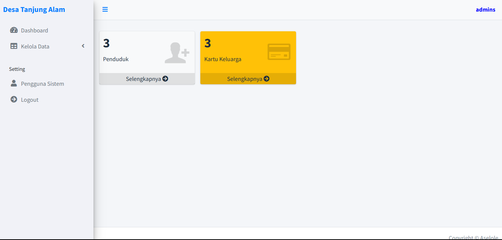

<p align="center">

</p>
# Data Penduduk Management System

## Introduction
The **Data Penduduk Management System** is a web-based application designed to manage population data efficiently. This system provides features for adding, updating, deleting, and viewing population data, including names, genders, addresses, and other relevant details. The project is built to streamline data management for government offices, organizations, or any entity handling large amounts of population data.

---

## Features
- **Add Population Data**: Input personal data, including name, gender, address, and other details.
- **View Population Data**: Display all registered population data in a structured and searchable format.
- **Update Population Data**: Edit or modify existing population records.
- **Delete Population Data**: Remove outdated or incorrect records from the database.
- **Filter by Attributes**: Filter records based on specific attributes like gender or address.

---

## Technologies Used
1. **Front-end**:
   - HTML, CSS, Bootstrap: For building responsive and user-friendly interfaces.
   - JavaScript: For dynamic client-side interactions.

2. **Back-end**:
   - PHP: For server-side logic and CRUD operations.
   
3. **Database**:
   - MySQL: For storing and managing population data.

---

## Installation
1. Clone the repository:
   ```bash
   git clone https://github.com/leo-lifecode/datadesaPHP.git
   ```
2. Navigate to the project directory:
   ```bash
   cd datadesaPHP
   ```
3. Set up the database:
   - Import the `database.sql`
   - Update the `koneksi.php` file with your database credentials.

4. Start a local PHP server:
   ```bash
   php -S localhost:8000
   ```
5. Open your browser and navigate to `http://localhost:8000`.

---

## Usage
1. **Home Page**:
   - View an overview of the system.
2. **Add Data**:
   - Navigate to the "Add Data" section to input new population data.
3. **View Data**:
   - Access the "View Data" section to browse all population records.
4. **Edit Data**:
   - Use the edit option to update specific records.
5. **Delete Data**:
   - Click the delete button to remove unwanted records.

---

## Contributions
Contributions to this project are welcome! Feel free to fork the repository and submit pull requests with enhancements or bug fixes.

---

## License
This project is licensed under the [MIT License](LICENSE).

